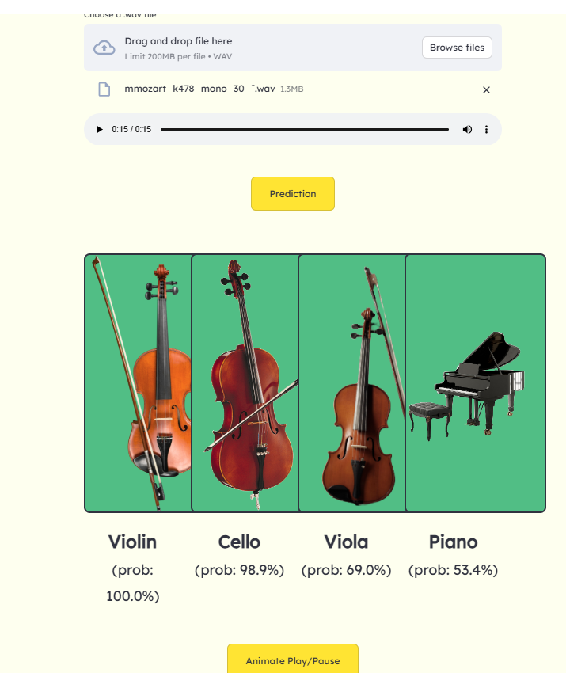

# Classical Music Instruments Classifier

**A Machine Learning model for classifying classical music instruments**

---

## Table of Contents
- [Project Overview](#project-overview)
- [Features](#features)
- [Technologies Used](#technologies-used)
- [Installation](#installation)
- [Usage](#usage)
- [Contributing](#contributing)
- [License](#license)

---

## Project Overview

The **Classical Music Instruments Classifier** is an application that uses a
Convolutional Neural Network based ML model to classify classical music instruments
from audio files. The app provides accurate predictions and can be expanded to
include more instruments or data sources.

This project demonstrates expertise in machine learning, data preprocessing,
and model deployment. It was built with the goal of creating an easy-to-use tool
that can be integrated into various applications such as music education or cataloging.

---

## Features
- **Instrument Classification**: Classifies a variety of musical instruments using pre-trained models.
- **Audio Input**: Supports audio files (WAV) for instrument identification.
- **Real-time Predictions**: Predicts the instrument in real-time with high precision.
- **Customizable Model**: Easily extendable with additional instrument data or improved models.
- **User-Friendly Interface**: Simple command-line or web interface (depending on implementation).

---

## Technologies Used
- **Python**
  - Core programming language used for building the application.
- **NumPy & Pandas**
  - For data manipulation and preprocessing.
- **Matplotlib/Seaborn**
  - For data visualization and model performance analysis.
- **TensorFlow/Keras**
  - Frameworks for developing and training machine learning models.
- **Librosa**
  - For audio analysis and feature extraction from audio files.
- **Streamlit**
  - Lightweight web framework for deploying the app as a web service
- **Docker**
  - For containerizing the application, ensuring consistency across development and deployment environments.
- **Google Cloud Run**
  - Serverless platform for deploying and scaling the application seamlessly.

## Installation

To run the **Classical Music Instruments Classifier**, follow these steps:

### Prerequisites
Make sure you have Python 3.6+ installed. You will also need `pip` to install dependencies.

### Setup:
1. **Clone the repository**:
   Run the following commands in your terminal:
   ```bash
   git clone https://github.com/iamkellym/inst_class.git
   cd inst_class

2. **Create and activate a virtual environment**:
   Run the following commands to create and activate a virtual environment:
   python(version) -m venv env
   source env/bin/activate (For Windows, use `env\Scripts\activate`)

3. **Install dependencies**:
   Install the required Python libraries.
   For working with the CNN model, use requirements_customCNN.txt
   If using the saved model, you can use requirements.txt

### Usage:
**Audio Preprocessing and Model**
All code for Audio and CSV Preprocessing, and the CNN Model training can be found
in their respective notebooks contained in the **notebooks** folder.

**Using the Saved Model**
The trained .keras model is stored in the **model** folder and can be loaded directly.

## Deployment

The **Instrument Classification App** is containerized using Docker and deployed on
**Google Cloud Run** for scalable, serverless hosting.

### Prerequisites
- Install [Docker](https://docs.docker.com/get-docker/).
- Install [Google Cloud SDK](https://cloud.google.com/sdk/docs/install) and set up project.
- Enable the **Cloud Run API** in your project.

### Steps to Deploy
Dockerfile and yml file can be found in the repository files.

1. Build and Tag the Docker Image:

2. Push the Image to Google Container Registry:

3. Deploy to Google Cloud Run:

4. Access the Deployed App

## API and User Interface

1. **API**: Built with FastAPI to handle requests and classification logic.
API files can be found in the **api** folder.
2. **Streamlit**: A web interface for interacting with the application. Code and
instrument images can be found in the **interface** folder.


